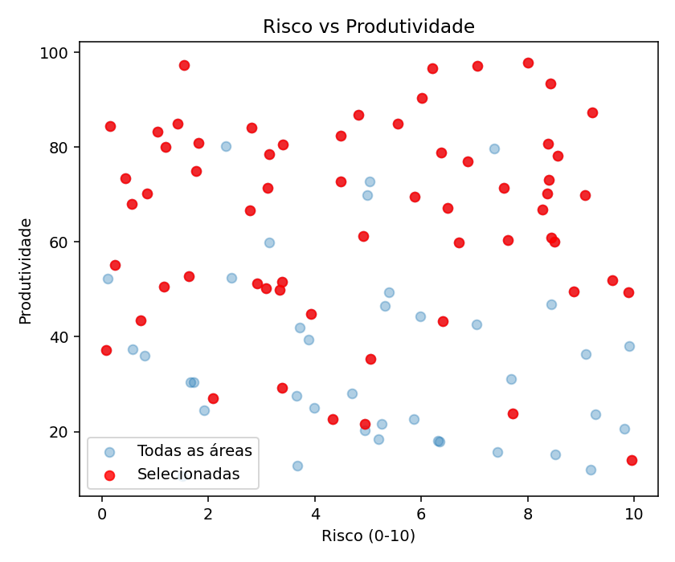

# Ir Além — Algoritmo Genético para Otimização Agrícola

> Projeto de otimização de seleção de áreas agrícolas usando Algoritmo Genético (GA) com múltiplos fatores e restrições realistas do agro.

## Descrição do Projeto
Este repositório implementa um pipeline completo para simular e otimizar a seleção de áreas agrícolas sob múltiplas restrições de recursos (orçamento, água, fertilizante) e fatores de risco, incorporando aspectos de rentabilidade e sustentabilidade. Os dados são gerados de forma sintética mas realista, permitindo reprodutibilidade por `seed`. O Algoritmo Genético aqui não busca apenas maximizar lucro: ele equilibra retorno econômico, risco operacional e uso eficiente de insumos, penalizando automaticamente soluções inviáveis. Inclui geração de dados, execução de experimentos parametrizados via JSON e análise detalhada (estatísticas, rankings, penalidades e gráficos de convergência).

Principais destaques:
- Fitness multifatorial (lucro, custo, risco, penalidades de recursos)
- Múltiplos constraints realistas (água, fertilizante, orçamento)
- Configurações de experimento em arquivos JSON para fácil reprodução
- Geração de dados sintéticos realistas com controle de `seed`
- Análise automatizada com métricas, rankings e visualizações
- Estrutura extensível para novos operadores de GA ou novas métricas

## Project Overview (English)
This repository delivers an end‑to‑end genetic algorithm workflow to optimize the selection of agricultural plots under realistic multi‑resource constraints (budget, water, fertilizer) while accounting for risk and profitability. Synthetic but plausible data is generated reproducibly using seeds. The GA does more than chase raw profit: it balances economic return, operational risk and sustainable resource consumption, automatically penalizing infeasible solutions. The stack covers data generation, experiment execution via JSON configuration, and a rich analysis script providing statistics, rankings, penalties and convergence charts.

Key Features:
- Multi-factor fitness (revenue, cost, risk, constraint penalties)
- Realistic constraints (water, fertilizer, budget)
- JSON-driven experiment configuration & reproducibility (seeded runs)
- Synthetic realistic dataset generation
- Automated result analysis: metrics, rankings, convergence plots
- Easily extensible for new GA operators or domain factors

---

---

## Objetivo
Selecionar o melhor conjunto de áreas de plantio para maximizar o lucro, respeitando limites de orçamento, água e fertilizante, considerando risco, tipo de solo e cultura.

## Experimento (Baseline)
O experimento baseline (`configs/baseline.json`) utiliza uma população de 100 indivíduos por até 100 gerações, seleção por torneio (`tournament_k=3`), crossover de um ponto e mutação bit flip com taxa inicial de 0.01. Há mecanismos de:
- Early stopping quando o progresso estagna por várias gerações.
- Aumento adaptativo da taxa de mutação em caso de estagnação.
- Elitismo opcional (1 indivíduo) para preservar a melhor solução.
Limites de recursos nesta configuração: `budget=1200`, `water_limit=1200 m³`, `fert_limit=600 kg`.
O histórico de convergência (melhor e média de fitness por geração) é persistido em memória e usado para gráficos.

## Estrutura de Pastas
```
farmtech-ir-alem/
├─ data/           # Dados simulados das áreas agrícolas
├─ src/            # Código fonte do GA e utilitários
├─ configs/        # Configurações de experimentos
├─ figures/        # Gráficos e diagramas
├─ results/        # Resultados dos experimentos
├─ requirements.txt
├─ README.md
├─ analyze_ga.py   # Script de análise completa dos resultados
└─ video_script.txt
```

## Principais Arquivos
- **src/data_generator.py**:  Gera dados sintéticos realistas para N áreas agrícolas, incluindo produtividade, custo, água (em litros), fertilizante, preço, risco, tipo de solo e cultura.
- **src/utils.py**: Lê o CSV de dados e retorna arrays para todos os atributos usados no GA.
- **src/ga_core.py**: Implementa o Algoritmo Genético com fitness multi-fator, múltiplos constraints, logging opcional e early stopping.
- **src/experiments.py**: Executa experimentos com configurações definidas em JSON, roda o GA e salva resultados em `results/`.
- **configs/baseline.json**: Exemplo de configuração de experimento, define limites de recursos e parâmetros do GA.
- **analyze_ga.py**: Script para análise completa dos resultados, estatísticas, rankings, gráficos e explicações detalhadas (fora do notebook).

## Como Funciona
1. **Geração dos Dados**
	- Execute:
	  ```powershell
	  python -m src.data_generator
	  ```
	- Gera `data/farm_data_seed42.csv` com atributos realistas para cada área.

2. **Configuração do Experimento**
	- Edite `configs/baseline.json` para definir:
	  - `budget`: orçamento máximo
	  - `water_limit`: limite de água
	  - `fert_limit`: limite de fertilizante
	  - Parâmetros do GA (população, gerações, métodos)

3. **Execução do Algoritmo Genético**
	Execute experimento:
    ```powershell
        python -m src.experiments --config configs/baseline.json
    ```
	- O GA seleciona subconjuntos de áreas maximizando receita líquida, penalizando violações de restrições.
	- Resultado salvo em `results/result_seed42.json`.

4. **Análise dos Resultados**
	 - Execute o script de análise:
		 ```powershell
		 python analyze_ga.py
		 ```
	 - O script apresenta:
		 - Estatísticas detalhadas das áreas selecionadas
		 - Ranking por produtividade e risco
		 - Penalidades aplicadas
		 - Gráficos de convergência e boxplot
		 - Apresentação explicativa dos resultados, com unidades (ex: água em litros)
		 - Textos amigáveis para facilitar interpretação
		 ```

## Modelo de Dados
Cada área agrícola tem os seguintes atributos:
- `prod`: produtividade estimada
- `cost`: custo total
- `water`: consumo de água
- `fert`: consumo de fertilizante
- `price`: preço de venda
- `risk`: índice de risco
- `soil_type`: tipo de solo
- `crop_type`: cultura

### Dados Sintéticos (Detalhes)
Os dados são inteiramente sintéticos porém gerados com faixas plausíveis para uma análise agrícola simplificada:
- Produtividade (`prod`) varia entre 10 e 100 (unidades de produção por área) para refletir heterogeneidade de potencial produtivo.
- Custo (`cost`) entre 1 e 50 para capturar diferenças de investimento requerido (insumos, preparo, logística local).
- Água (`water`) entre 5 e 30 m³ e fertilizante (`fert`) entre 2 e 15 kg simulam necessidades de insumos com variação moderada.
- Preço (`price`) entre 0.8 e 2.0 reflete flutuação de mercado entre culturas (ex.: soja, milho, algodão, trigo).
- Risco (`risk`) entre 0 e 10 agrega fatores como variabilidade climática, pragas e volatilidade operacional.
- Tipos de solo (`soil_type`): `argiloso`, `arenoso`, `siltoso` — cada um pode implicar em diferenças indiretas de produtividade e custo (não explicitadas no código, mas passíveis de extensão).
- Culturas (`crop_type`): `soja`, `milho`, `algodao`, `trigo`, permitindo cenários de diversificação. O modelo atual trata todas igualmente em termos de fórmula de fitness, mas o campo existe para futuras regras específicas.
Todos os atributos são gerados de forma independente; correlações (ex.: solos mais arenosos com maior risco) podem ser adicionadas futuramente para maior realismo.

## Fitness Realista
O fitness de cada solução é calculado como:
```
fitness = receita_total - custo_total - risco_total - penalidades
```
Penalidades são aplicadas se orçamento, água ou fertilizante forem excedidos.

**O que significa o melhor fitness?**
O melhor fitness representa a qualidade da melhor solução encontrada pelo GA, considerando todos os fatores do problema (lucro, custo, risco, penalidades por exceder limites). Não é simplesmente dinheiro gasto ou área plantada, mas sim uma métrica composta que reflete o benefício agrícola total, respeitando as restrições e minimizando riscos.

## Principais Escolhas e Justificativas
- **Fitness multi-fator**: Reflete decisões reais do agro, considerando lucro, risco e sustentabilidade.
- **Múltiplos constraints**: Garante viabilidade operacional e ambiental.
- **GA flexível**: Permite testar diferentes estratégias de seleção, cruzamento e mutação.
- **Reprodutibilidade**: Uso de seed para garantir resultados consistentes.

## Como rodar do zero
1. Instale dependências:
	```powershell
	python -m pip install -r requirements.txt
	```
2. Gere dados:
	```powershell
	python -m src.data_generator
	```
3. Execute experimento:
	```powershell
	python -m src.experiments --config configs/baseline.json
	```
4. Analise resultados:
	```powershell
	python analyze_ga.py
	```
	- O script mostra todas as análises, rankings, penalidades, gráficos e explicações detalhadas.
	- Todos os valores de água são apresentados em litros para facilitar a interpretação.
	- Figuras são salvas automaticamente em `figures/` (ex.: `convergence.png`, `risk_vs_prod.png`).

## Resultados e Análise
- Resultados dos experimentos são salvos em `results/`, com nomes únicos para cada execução.
- Resultados de batch são exportados em CSV para facilitar análise e comparação.
- O script `analyze_ga.py` apresenta todas as análises relevantes, com explicações e unidades.

## Visualizações
Ao rodar `python analyze_ga.py` são gerados e salvos automaticamente:
- `figures/convergence.png`: curva de convergência (melhor e média de fitness por geração).
- `figures/risk_vs_prod.png`: dispersão risco vs produtividade, destacando áreas selecionadas em vermelho.
- `figures/best_fitness_box.png`: distribuição do melhor fitness ao longo das gerações.

### Exemplo de Convergência


### Risco vs Produtividade


> Caso as imagens não apareçam após o primeiro run, verifique se a pasta `figures/` foi criada e se o script terminou sem erros.

